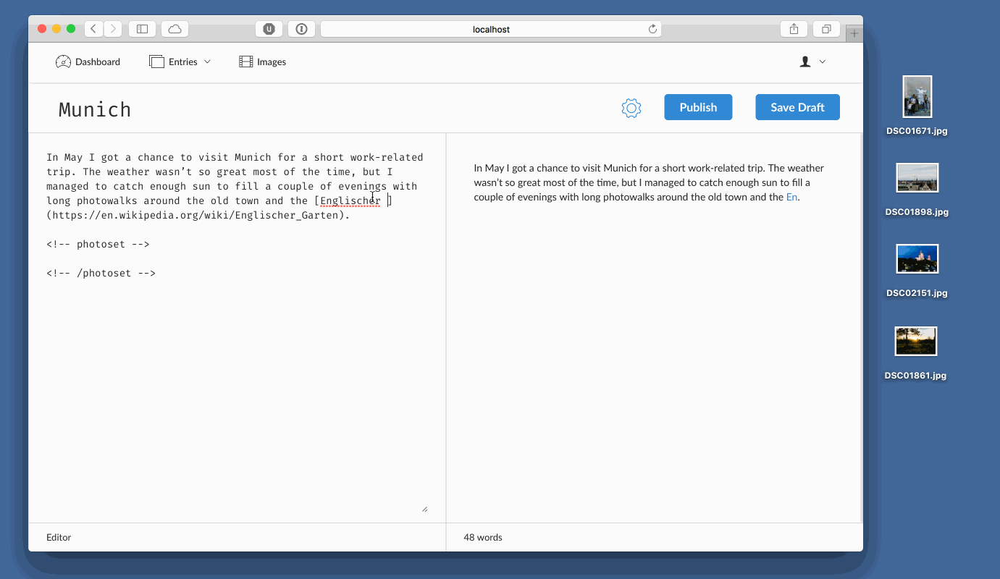

# Blogging with Markdown, Dropbox and Rails

My last year's [tutorial on How to Build a CMS in Rails][tutorial] came into existence as a byproduct of a selfish goal. I wanted to build a simple and flexible CMS for my personal needs and ended up documenting the process. The version I described in the tutorial was the starting point – a rough sketch of some of the ideas I had at the time. Fast forward a year (and multiple concepts), I’ve finally arrived at a result satisfying enough to rebuild this site using my own CMS.

You may ask, why would I spend so much time re-inventing the wheel? With so many options for hosting a personal site these days, it’s mind-boggling that someone would choose to build everything from scratch. Well, even though I don't write often, this website is important to me — not only as a publishing platform. It also serves as a playground for various coding experiments that help me grow professionally and keep me interested in web development. On top of that, I simply wanted to have a system I’d be happy with.

The previous version of this blog was a plain Jekyll-based static website, hastily slapped together within a couple of evenings. While Jekyll is a cool project with lots of well-executed ideas, it never really clicked with me. Dynamic websites is something that got me hooked on development years ago and the static websites trend that proliferated in the last couple of years among developers has always felt like a step back. Initially, the promise of speed and security lured me to the idea as well, but soon enough the trade-offs and quirks became too frustrating to deal with. To name a few: I’m not a fan of having to re-generate the site on each change, I don’t like how Jekyll handles friendly urls (the index.html hack which leads to trailing forward slashes in URLs) and I don’t like to keep my content with the codebase. The boiling point, though, was a particularly painful Jekyll gem upgrade that completely broke my website and took long hours of wrestling with errors and dependency hell to get the site running again.[^jekyll-downsides].

<figure>
  
</figure>

So I decided to build my own Rails-based CMS that would be able to handle blog posts, static pages and responsive photo stories.[^inspiration]

[tutorial]: https://github.com/pch/pch/blob/main/writing/rails-cms/2015-09-18-tutorial-how-to-build-a-cms-in-ruby-on-rails.md

* * *

## Early Iterations

Despite my mixed feelings towards Jekyll, it has a feature I could barely manage without: writing in plain Markdown, with YAML Front Matter for metadata. Back when I started working on the CMS, I was infatuated with the idea of [Ghost](http://ghost.org)-like Markdown live preview and drag-and-drop image upload. I spent quite some time building several versions of the UI for it and the result was a fairly elaborate form with everything I ever wanted:

<figure>
  
  <figcaption>Fancy form with drag-and-drop upload, live preview and photo galleries.</figcaption>
</figure>

It worked well and I patted myself on the back, ready to deploy the new website and tell the world about my invention. But as I began to use the form, slowly it dawned on me that I had built something that doesn’t even fit my workflow. I would still write in my [favorite Markdown editor][iawriter], paste the result to the web form and click “Publish”. Edits, typos? I'd edit the original file, commit changes to GitHub, then paste the whole text again in the form.

I had to start over.

[iawriter]: https://ia.net/writer

## The Final Result

This time I reverse-engineered my workflow. I wanted to be able to edit plain text files on my Mac and have the result automatically show up on the site, without having to use an admin panel for content management. Whenever a file in the content directory is updated, whether it’s a Markdown document or an image, I want my Rails app to import the changes automatically.

Dropbox seemed like a natural fit, as it allows me to access files on any device (whether it’s macOS, iOS, Windows or Linux). This includes the web server, which also has access to the content directory, so any changes I make locally will be synced to the server and my website will be updated within seconds:

<figure>
<video controls>
  <source src="./dropbox-sync.mp4"  type="video/mp4">
Your browser does not support the video tag
</video>
  <figcaption>A quick demo of Dropbox sync (no sound).</figcaption>
</figure>

The content directory is also a regular git repo — for revision control and additional backup. Blog posts are imported to the database. The database and images are backed up daily to an Amazon S3 bucket.

Call me paranoid, but with this setup it’s pretty much impossible for me to lose any content[^storm]. My hard drive, Time Machine backup, Dropbox, GitHub, web server and Amazon S3 would all have to implode at the same time.

## The Nitty-Gritty

### Backend

This website is a regular Ruby on Rails & Postgres-based application with a custom open-source [CMS engine][plotline]. The CMS gem provides all the essential functionality needed to create any content type. Whether it's a blog post, a photo story or a static page, you only need to create a new model file and define custom attributes. Data (except for title and body) is stored in a JSON database field, so there’s no need to write any migrations when you introduce a new content type. Full-text search (Postgres-based) and tags are included as well.

Content is stored in a Dropbox directory, which syncs files between my computer and the server. On the server, I have a [script](https://github.com/pch/plotline/blob/master/bin/plotline) that monitors the content directory for changes and imports them to the database. This means that whenever I edit a markdown file or upload a new image, it will be synced to the app within seconds.

### Images and Thumbnails

Images are one of the key aspects of this site. With responsive photo galleries, it was important to have a flexible mechanism for processing thumbnails and image metadata (dimensions and EXIF).

A popular approach for thumbnails is to generate a couple of different smaller version of an image on upload. I wanted to avoid that, because it requires me to reprocess all thumbnails each time I change image dimensions in the code.

This is where [Thumbor](http://thumbor.org) comes in. It’s a great open-source solution for all image processing you can think of. It provides tons of useful features like smart cropping, face detection, filters etc. For me, though, the most important feature is the option to generate thumbnails on the fly. If I need a smaller version of an image, it's only a matter of changing a couple of params in the URL. Thumbnails are cached (locally on the server and using CloudFlare CDN), so there’s no performance loss.

On upload, EXIF metadata is extracted from photos (with the amazing [ExifTool][exiftool]) and stored in the database as serialized JSON. There are a couple of interesting client-side solutions that allow to extract EXIF using JavaScript, but I find ExifTool a little more reliable and versatile. Storing EXIF in the database opens up a lot more opportunities for working with photos, e.g. querying images by location or camera setting. My original idea behind it, though, was just to be able to show photos on a map (using coordinates from EXIF) and display camera settings for a given photo. In an early version of the new site, I used geolocation data to display weather information in photo stories, but decided to remove it due to unreliable results[^weather].

[exiftool]: http://www.sno.phy.queensu.ca/~phil/exiftool/

## Frontend

The frontend for the site was built with the help of [Bourbon](http://bourbon.io) and [Neat](http://neat.bourbon.io). I based the responsive photosets functionality on a [tutorial by Terry Mun](https://medium.com/coding-design/responsive-photosets-7742e6f93d9e) — with some modifications and [PhotoSwipe](http://photoswipe.com) for further enhancements.

Footnotes are handled by [bigfoot.js](http://www.bigfootjs.com) and I use [highlight.js](https://highlightjs.org) for syntax highlighting.

## Deployment and Hosting

With Dropbox sync and Thumbor, deployment cant get a little complicated. I wanted to be able to deploy the app on any [Ubuntu-based VPS](https://marco.org/2014/03/27/web-hosting-for-app-developers). The process should be automated and reusable. I considered a couple of solutions, but in the end I decided to create an [Ansible playbook](http://docs.ansible.com/ansible/playbooks.html) to automate all the daunting tasks of setting up the dependencies, backups and basic security. Thanks to Ansible, the process of deploying the app from scratch takes no more than 30 minutes[^caveat] and it goes like this:

1. Create a new droplet on [DigitalOcean](https://m.do.co/c/5ba235a58e95) or [Linode](https://www.linode.com).
2. Run the [Ansible playbook](https://github.com/pch/plotline-ansible).
3. Link your Dropbox account to the server[^dropbox-link].
4. Deploy the Rails app via [Capistrano](http://capistranorb.com) or [Mina](http://nadarei.co/mina/).

Once these steps are completed, the website should be up and running.

## The Good, the Bad & the Ugly

I’ve used this setup for a couple of months now and I’m pretty happy with how it works. Editing workflow is seamless, the app is easy to extend, maintain and deploy. Data is safely backed up, I can spin off a new server within minutes (if I break something or if I decide to switch hosts) and I can use my favorite tools to create content.

But there are some serious drawbacks as well. The initial setup and configuration can be a hassle and, as with almost any Rails app, it may take some time to get comfortable with how everything works.

Admin panel for the CMS is very basic and needs a lot of work to get it to a usable state (right now it only displays entries and images). I’d still love to incorporate the fancy Markdown form back to the CMS at some point, as it would make the software more accessible. However, with the Dropbox setup, it’s a little tricky to combine both workflows (local text editor & online form) in a way that would prevent accidental overwrites.

## Can I Try It as Well?

Yes, if you’re so adventurous! The CMS engine I described is called [Plotline][plotline] and it's open source, released under MIT license. Be sure to check out the README file and the [demo blog](https://github.com/pch/plotline-demo-blog) for more examples.

The [Ansible playbook](https://github.com/pch/plotline-ansible) is also available on GitHub.

Please keep in mind, though, that this is a project built for my personal use, so it may have certain bugs and imperfections I’m not aware of yet (or I’ve deliberately decided to ignore). If you decide to try Plotline anyway, feel free to or open an issue/pull request on GitHub if you find any problems.

[plotline]: https://github.com/pch/plotline

[^inspiration]: Huge credit for the inspiration goes to [Paul Stamatiou](http://paulstamatiou.com). I’ve always been a fan of his blog and his beautiful photosets. [Exposure](http://exposure.co), [Medium](http://medium.com) and [Squarespace](https://www.squarespace.com) have also served as sources of shamelessly stolen ideas for this site.

[^jekyll-downsides]: Keep in mind that these are all highly subjective experiences. I know a lot of people are super happy with Jekyll and have never had such issues, so take it with a grain of salt.

[^storm]: If you count out the chance of a huge [geomagnetic storm](https://en.wikipedia.org/wiki/Geomagnetic_storm) ☀️⚡️🌎

[^weather]: For example, the weather API I used returned "Clear sky" for a photo taken on a rainy day.

[^caveat]: Assuming that stuff like domain name and user & application passwords is already configured.

[^dropbox-link]: Unfortunately this step can’t be automated.
