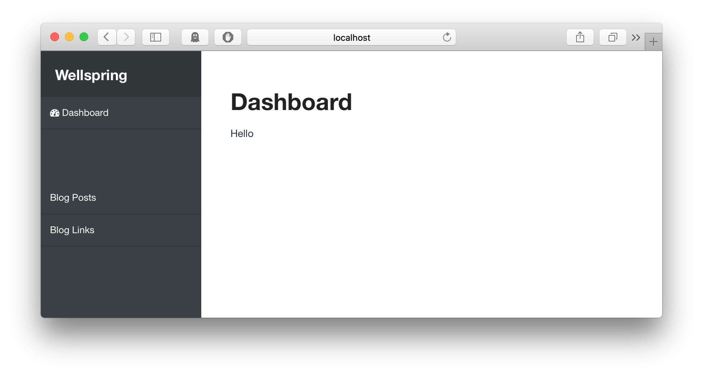
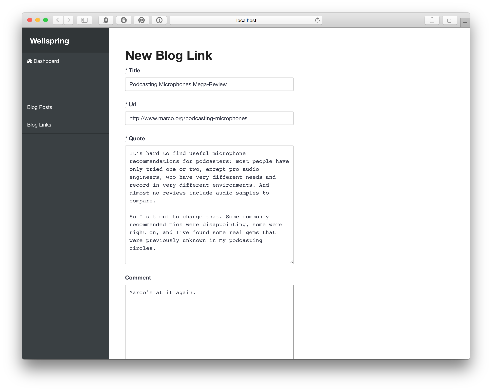
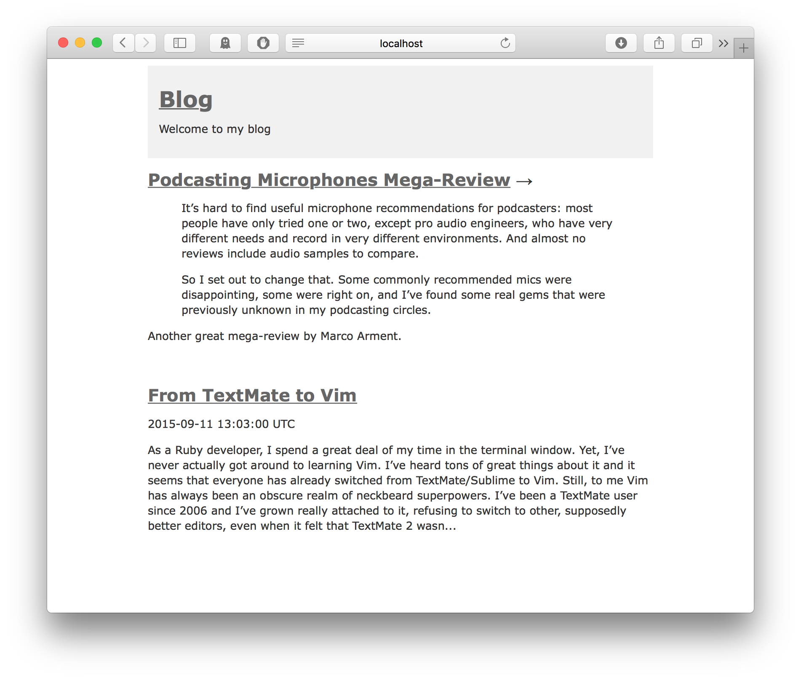
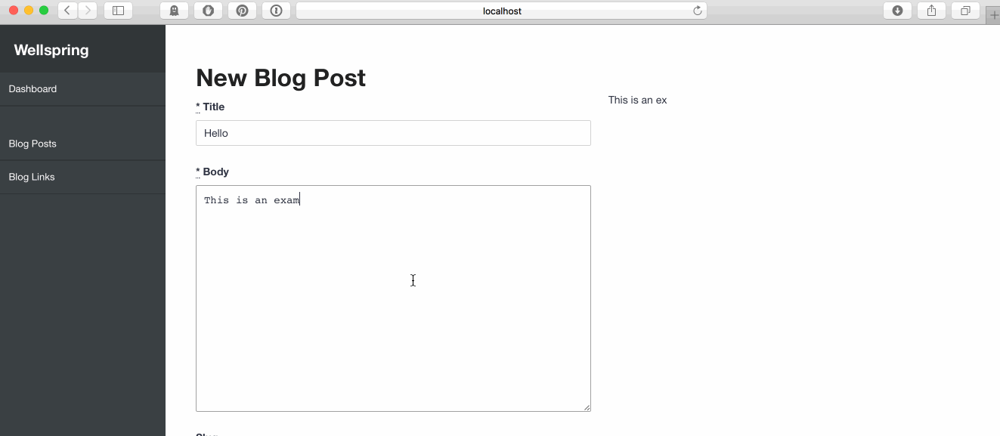

# How to Build a CMS in Ruby on Rails

*(**NOTE:** This tutorial was originally published in 2015 and some parts may not work with the latest versions of Rails.)*

I remember exactly when and why I started learning Ruby and Rails. It was right after I saw the famous ["blog in 15 minutes"][blog15] video by DHH. This quick, clumsy demo of the new web framework, written in an exotic programming language, was like a breath of fresh air – a comforting, elegant answer to all the little annoyances I was constantly dealing with in PHP. I immediately wanted to know more about Rails, so I got my hands on [The Pickaxe][pickaxe] book and devoured it in a couple of evenings.

What I loved the most about the video and the book (and [railscasts][railscasts] later on) was that they focused on showing me **what I can do** with Rails. There weren't any contrived ”imagine a car" analogies, only real-world examples I could easily turn into a working web app – something I could build upon later in my projects.

If you're learning Rails right now, this guide is for you. It's my little attempt at a real-world example of what you can do with Rails. I'll try to show you how to build a flexible, reusable CMS engine using various features offered by RoR and Postgres.

## Why a CMS?

CMS in 2015 is probably one of the least inventive things to build from scratch. Nevertheless, it’s still the most widely used type of software on the internet – and probably the type of software you’ll find yourself building multiple times during your web development career in one form or another. The real reason, though, is that I wanted to build a simple CMS for my own needs and decided it might be a good idea to describe the process here.

The concept of Content Management System has been approached countless times and in most cases it makes very little sense not to use a well-established solution for your project. But we’re not building a competitor for WordPress or Ghost here. That’s not the point of this tutorial.

We're only interested in the process that goes into building a CMS from scratch. How do you begin? How do you define the problem? How do you divide the work into smaller, non-intimidating chunks? How to build [the simplest thing that could possibly work](http://c2.com/cgi/wiki?DoTheSimplestThingThatCouldPossiblyWork)?

This tutorial assumes you have some knowledge about Ruby, Rails, Postgres, JavaScript, plus basic understanding of: [Single Table Inheritance][sti], [JSON][json], [full-text search][fulltext] and [Markdown][markdown]. It’s definitely not targeted at total beginners, but you won’t find anything unattainable here.

* * *

**Table of Contents:**

1. [Getting Started](#getting-started)
2. [Data Model](#data-model)
2. [Admin Interface](#admin-interface)
3. [Blog](#blog)
4. [Search](#search)
5. [User Authentication](#user-authentication)
6. [Markdown & Live Preview](#markdown-live-preview)


[blog15]: https://www.youtube.com/watch?v=Gzj723LkRJY
[pickaxe]: https://pragprog.com/book/rails4/agile-web-development-with-rails-4
[railscasts]: http://railscasts.com/
[wellspring]: https://github.com/pch/wellspring
[wellspring-blog]: https://github.com/pch/wellspring-example-blog

[sti]: http://api.rubyonrails.org/classes/ActiveRecord/Inheritance.html
[fulltext]: http://www.postgresql.org/docs/9.1/static/textsearch-intro.html
[markdown]: http://daringfireball.net/projects/markdown/
[json]: http://ruby-doc.org/stdlib-2.0.0/libdoc/json/rdoc/JSON.html

* * *

## <a name="getting-started"></a>Getting Started

Let’s take a minute to think about what we’re aiming to build here.

We want a reusable piece of code that will allow us to create a blog or any type of content site. It should support multiple content types: blog posts, articles, galleries etc. Ideally, it should be implemented as a plugin, so that we can reuse it in multiple Rails apps. Content will be created via admin panel and we should not have to do modify anything in the admin code when we introduce a new content type. Admin panel will be the only fixed part of the system – the way content is presented is 100% up to the person using our CMS.

Last but not least, we need a fancy name for our project. Let's call it **Wellspring**.

<aside class="notes">
<h3>Source Code</h3>
The complete source code of [Wellspring][wellspring] is available on GitHub.
</aside>

### Set up the Project

Since we’ve chosen to implement Wellspring as a plugin, we’re going to need 2 Rails projects: one for the CMS engine and other for our main app – a simple blog. This setup complicates the workflow a little bit, as we'll be moving back and forth between Wellspring and the blog app quite a lot. It's not too bad, though – Rails takes care of reloading modified code from [mountable engines][engine], so you won't have to restart your server every time you make a change to Wellspring.

Fire up your terminal and run the following commands:

```bash
$ rails plugin new wellspring --mountable --database=postgresql --skip-spring --skip-turbolinks
$ rails new blog --skip-turbolinks --skip-spring --database=postgresql
$ cd blog
```

Let’s mount Wellspring to our blog app. Add the following line to `Gemfile`:

```ruby
# blog: Gemfile
gem 'wellspring', path: '../wellspring/'
```

Run `bundle` to install required gems. Next, insert this line in `config/routes.rb`:

```ruby
# blog: config/routes.rb
mount Wellspring::Engine, at: '/admin'
```

Everything's set up now, we have a basis for our project, so let's start thinking about the data model.

[engine]: http://edgeguides.rubyonrails.org/engines.html

## <a name="getting-started"></a> Data Model

As mentioned earlier, we want our CMS to be able to handle just about any type of content. Whether it's a blog post, photo gallery or a music album, our code should support it out of the box.

Since we don't really know what types of content we may need in the future, our solution should be flexible enough so that it doesn't require modifying the database structure each time we introduce a new type of content. That's why we'll create a single table called "entries", which will serve as a universal storage for all content types.

Because we're using Postgres, rather than a NoSQL solution (like MongoDB), we have a fixed set of columns in our table. This means we need a special column for storing all the custom attributes our content classes need (blog posts will have 'body', music albums will have 'artist', 'tracks', 'release date' etc.).

JSON is a great fit for this purpose. Postgres supports [JSON columns](http://www.postgresql.org/docs/9.4/static/datatype-json.html) natively and we'll take advantage of that.

Let's start with the model:

```bash
$ cd wellspring
$ rails generate model Entry
```

Put the following code in `db/*_create_entries.rb`:

```ruby
# wellspring: db/*_create_entries.rb:
create_table :wellspring_entries do |t|
  t.string :type, index: true
  t.string :title
  t.string :slug, index: true
  t.json :payload
  t.integer :user_id, index: true
  t.string :author_name

  t.datetime :published_at
  t.timestamps null: false
end
```

This is our main table. The `type` column indicates that it's a [Single Table Inheritance][sti] (STI) model, which means that we can create our custom types of content simply by inheriting from `Entry`.

We assume that `title`, `slug` (friendly URL) and `published_at` are the only fields common to all types of content. The `payload` column will store any other data our content requires. The great advantage of using the native JSON data type is that we can easily query against our dynamic attributes:

```ruby
# find all projects for the given client
PortfolioEntry.where('payload->client_name = ?', 'ACME')
```

Let's plow ahead, though. Move back to the `blog` project and run:

```bash
$ rake wellspring:install:migrations
$ rake db:create
$ rake db:migrate
```

We have the basis for our content data, so let's now create a class for blog posts. Blog post usually consist of a title and body. We already have a title column in the database table, so we only need to handle `body` text.

Create the following file in your `blog` project in `app/models/blog_post.rb`:

```ruby
# blog: app/models/blog_post.rb
class BlogPost < Wellspring::Entry
  content_attr :body, :text
end
```

We've created a new content class, `BlogPost`, and since we're inheriting from `Entry`, there's no need to create any migrations. We've also declared that `BlogPost` has a custom text attribute (`content_attr`) called `body`.

The last part is not implemented yet, so let's go back to `Wellspring::Entry` and add the following code:

```ruby
# wellspring: app/models/wellspring/entry.rb
module Wellspring
  class Entry < ActiveRecord::Base
    scope :published, -> { where('published_at <= ?', Time.zone.now) }

    def self.content_attr(attr_name, attr_type = :string)
      content_attributes[attr_name] = attr_type

      define_method(attr_name) do
        self.payload ||= {}
        self.payload[attr_name.to_s]
      end

      define_method("#{attr_name}=".to_sym) do |value|
        self.payload ||= {}
        self.payload[attr_name.to_s] = value
      end
    end

    def self.content_attributes
      @content_attributes ||= {}
    end
  end
end
```

Every time `content_attr` is called, it will create accessor methods for the given attribute, so that we can use it as if they were regular ActiveRecord attributes:

```ruby
post = BlogPost.new
post.title = "Hello World"
post.body = "I'm a blog post!"
post.body #=> "I'm a blog post!"
```

The value of `body` is stored as JSON within the `payload` field, so `content_attr` is in fact just a way to wrap the `payload` hash:

```ruby
post.payload #=> {"body"=>"I'm a blog post!"}
post.payload["body"] #=> "I'm a blog post!"
```

Since we're using the native JSON type attribute, we don't have to worry about serialization – ActiveRecord takes care of that.

Another desirable side effect of having `content_attr` is that it allows us to use validations for our custom attributes:

```ruby
class BlogPost < Wellspring::Entry
  content_attr :body, :text

  validates :body, presence: true
end
```

For a simple blog, that's all we need. But let's introduce another type of content: a link post. It will allow us to post links to other blogs, with a quote and a short comment – in a [Daring Fireball](http://daringfireball.net/) fashion. This is our new model:

```ruby
# blog: app/models/blog_link.rb
class BlogLink < Wellspring::Entry
  content_attr :url, :string
  content_attr :quote, :text
  content_attr :comment, :text

  validates :url, presence: true
  validates :quote, presence: true
end
```

We're now ready to start building the admin panel.

* * *

##<a name="admin-interface"></a> Admin Interface

Admin panel is the central part of our CMS. We want to have a single interface for all types of content – without repeating any unnecessary code.

Let's create our controller in the `wellspring` project:

```bash
$ cd wellspring
$ rails g controller entries
```

This single controller will be responsible for listing, creating, editing and destroying entries – for descendants of Entry. We don't want to create a new controller every time we introduce a new content class. `EntriesController` should be able to handle it out of the box.

The controller itself is going to be a regular Rails [CRUD](https://en.wikipedia.org/wiki/Create,_read,_update_and_delete), but since we want it to handle blog posts, blog links and other types we don't have yet, we need to give it some additional context. We need to know which content class we're dealing with at the given moment:

```ruby
# wellspring: config/routes.rb
Wellspring::Engine.routes.draw do
  scope "/:content_class" do
    resources :entries
  end
end
```

We've wrapped `entries` in a scope, which requires an additional `content_class` param for the `entries` resource. Example urls for our blog content will look like this:

```bash
/admin/blog_posts/entries/
/admin/blog_posts/entries/new
/admin/blog_posts/entries/edit

/admin/blog_links/entries/
/admin/blog_links/entries/new
/admin/blog_links/entries/edit
```

Let's go back to `EntriesController`. Here's how it should look like:

```ruby
# wellspring: app/controllers/wellspring/entries_controller.rb
require_dependency "wellspring/application_controller"

module Wellspring
  class EntriesController < ApplicationController
    before_action :set_entry, only: [:show, :edit, :update, :destroy]

    def index
      @entries = Entry.where(type: content_class)
    end

    def show
    end

    def new
      @entry = Entry.new(type: content_class)
    end

    def edit
    end

    def create
      @entry = Entry.new(entry_params)

      if @entry.save
        redirect_to content_entry_path(@entry), notice: 'Entry was successfully created.'
      else
        render :new
      end
    end

    def update
      if @entry.update(entry_params)
        redirect_to content_entry_path(@entry), notice: 'Entry was successfully updated.'
      else
        render :edit
      end
    end

    def destroy
      @entry.destroy
      redirect_to content_entries_path, notice: 'Entry was successfully destroyed.'
    end

    private

    def set_entry
      @entry = Entry.find(params[:id])
    end

    def entry_params
      allowed_attrs = %i(id type title slug published_at)
        .concat(content_class.constantize.content_attributes.keys)

      params.require(:entry).permit(*allowed_attrs)
    end

    def content_class
      @content_class ||= params[:content_class].classify
    end
    helper_method :content_class
  end
end
```

Thanks to `content_class`, Entries controller knows which type of content is being processed. Besides that, we've introduced another non-standard tweak to Rails' [strong parameters](http://edgeapi.rubyonrails.org/classes/ActionController/StrongParameters.html). We've written the `entry_params` method in a way that it permits custom content params, based on `content_class`. So in our case it's the equivalent of:

```ruby
# blog post:
params.require(:entry).permit(:id, :type, :title, :slug, :published_at, :body)

# blog link:
params.require(:entry).permit(:id, :type, :title, :slug, :published_at, :url, :quote, :comment)
```

You'll also notice that we have non-standard routes (`content_entries_path`, `content_entry_path` etc.). This is just a custom wrapper for the `entries` routes, so we don't have to pass `content_class` to routes every time:

```ruby
# wellspring: app/controllers/wellspring/application_controller.rb
def content_entries_path
  entries_path(content_class: content_class.tableize)
end
helper_method :content_entries_path
```

* * *

This is how our basic panel looks:



As you can see on the left, we have a list of all the content classes we support. But how do we know which content classes are available in the app?

There are a couple ways to determine it. Most logical one would be to get the list of all descendants of `Entry`. There is a catch, though:

```ruby
# rails console
>> Wellspring::Entry.descendants
=> []
>> BlogPost
#=> BlogPost (call 'BlogPost.connection' to establish a connection)
>> Wellspring::Entry.descendants
#=> [BlogPost (call 'BlogPost.connection' to establish a connection)]
>> BlogLink
#=> BlogLink (call 'BlogLink.connection' to establish a connection)
>> Wellspring::Entry.descendants
#=> [BlogPost (call 'BlogPost.connection' to establish a connection), BlogLink (call 'BlogLink.connection' to establish a connection)]
```

When we first call `Wellspring::Entry.descendants` it returns an empty array. This is the magic of autoload in Rails - classes are not loaded until they are first called. This means that Rails doesn't know anything about the existence of BlogPost until we try to use it. When Rails sees a call to an unknown constant, it attempts to load it from the autoload path, using [const_missing](http://apidock.com/ruby/Module/const_missing).

So, in order for `Wellspring::Entry.descendants` to work, we'd have to either enable the "[eager_load](http://blog.arkency.com/2013/12/rails4-preloading/)" setting for development, or `require` content class files manually to bypass autoload. We don't want to mess with the defaults, though, so we'll solve this in another way: with our own configuration.

```ruby
# wellspring: lib/wellspring/configuration.rb
module Wellspring
  class Configuration
    attr_accessor :content_classes

    def initialize
      @content_classes = [].freeze
    end
  end

  def self.configuration
    @configuration ||= Configuration.new
  end

  def self.configure
    yield configuration
  end
end
```

Next, require our configuration in `lib/wellspring.rb`:

```ruby
# wellspring: lib/wellspring.rb
require "wellspring/engine"
require "wellspring/configuration"

module Wellspring
end
```

Right now, we only have one configuration option: `content_classes`, which is an empty array by default. Our application will have to explicitly declare the list of content classes it provides:

```ruby
# blog: config/initializers/wellspring.rb
Wellspring.configure do |config|
  config.content_classes = %w(BlogPost BlogLink)
end
```

Add the initializer above to the blog app and restart your server. Go back to Wellspring and add the sidebar markup in `application.html.erb`:

```rhtml
  <ul>
    <% Wellspring.configuration.content_classes.each do |class_name| %>
      <li>
        <%= link_to class_name.tableize.titleize, entries_path(content_class: class_name.tableize) %>
      </li>
    <% end %>
  </ul>
```

Our `index` view of `EntriesController` should look like this:

```rhtml
  <h1><%= content_class.tableize.titleize %></h1>

  <%= link_to "New #{content_class.titleize}", new_content_entry_path, class: 'btn btn-primary space-2' %>

  <table class="table space-4">
    <thead>
      <tr>
        <th>Title</th>
        <th>Created at</th>
        <th>Published at</th>
        <th colspan="2"></th>
      </tr>
    </thead>

    <tbody>
      <% @entries.each do |entry| %>
        <tr>
          <td><%= link_to entry.title, content_entry_path(entry) %></td>
          <td><%= time_ago_in_words entry.created_at %> ago</td>
          <td><%= entry.published_at %></td>
          <td><%= link_to 'Edit', edit_content_entry_path(entry) %></td>
          <td><%= link_to 'Destroy', content_entry_path(entry), method: :delete, data: { confirm: 'Are you sure?' } %></td>
        </tr>
      <% end %>
    </tbody>
  </table>
```

With that in place, we can start implementing the form.

### Entry Form

Our universal content form should display input fields for `title`, `slug`, `author_name` and `published_at`, as well as fields for custom content attributes, based on the `content_class` we're creating/editing:

```rhtml
  <%= simple_form_for(@entry, as: :entry, url: entries_path) do |f| %>
    <%= f.hidden_field :type, value: @entry.type %>

    <%= f.input :title %>

    <% @entry.class.content_attributes.each do |attr_name, attr_type| %>
      <%= f.input attr_name, as: attr_type %>
    <% end %>

    <%= f.input :slug %>
    <%= f.input :author_name %>
    <%= f.input :published_at %>

    <%= f.submit "Save" %>
  <% end %>
```

And here's our form in action:



As you can see, it automatically adjusts to the content class we're dealing with at the moment, displaying proper fields. But how does it know whether a field should be a textarea, an input, or a date dropdown? Here, we're taking advantage of [simple_form](https://github.com/plataformatec/simple_form) and the fact that it [maps data types to input types](https://github.com/plataformatec/simple_form#available-input-types-and-defaults-for-each-column-type). We've declared our content attributes as `content_attr :comment, :text`, so simple_form knows that a `:text` attr should be a textarea, and a `:string` attr should be displayed a regular input.

* * *

## <a name="user-interface"></a>Blog

Now that we have a basic admin interface, we can start displaying our blog posts

```bash
$ cd blog
$ rails g controller Posts index show --assets=false --helper=false
```

Change `routes.rb` to this:

```bash
# blog: config/routes.rb
Rails.application.routes.draw do
  mount Wellspring::Engine, at: "/admin"

  get '/:slug', to: 'blog_posts#show'
  root to: 'blog_posts#index'
end
```

In our posts controller, we need two actions: index & show. We should display only published blog posts:

```ruby
# blog: app/controllers/posts_controller.rb
class PostsController < ApplicationController
  def index
    @posts = BlogPost.published.order('id desc')
  end

  def show
    @post = BlogPost.published.find_by_slug!(params[:slug])
  end
end
```

But we want to display both BlogPosts and BlogLinks in a single list. Let's change our code a bit:

```ruby
# blog: app/controllers/posts_controller.rb
class PostsController < ApplicationController
  def index
    @posts = blog_posts_with_links.order('id desc')
  end

  def show
    @post = blog_posts_with_links.find_by_slug!(params[:slug])
  end

  private

  def blog_posts_with_links
    Wellspring::Entry.where(type: %w(BlogPost BlogLink)).published
  end
end
```

Now we're ready to move on to the views:

```rhtml
    <!-- blog: app/views/posts/index.html.erb -->
    <ul class="posts">
      <% @posts.each do |post| %>
        <li><%= render blog_post %></li>
      <% end %>
    </ul>

    <!-- blog: app/views/blog_posts/blog_post.html.erb -->
    <h2><%= link_to blog_post.title, blog_post.slug %></h2>
    <p class="meta"><%= blog_post.author_name %> <%= blog_post.published_at %></p>
    <p class="intro"><%= truncate(blog_post.body, length: 500) %></p>

    <!-- blog: app/views/blog_links/blog_link.html.erb -->
    <h2><%= link_to blog_link.title, blog_link.url %> &#8594;</h2>
    <blockquote>
      <%= simple_format blog_link.quote %>
    </blockquote>
    <p class="comment"><%= blog_link.comment %></p>

    <!-- blog: app/views/blog_posts/show.html.erb -->
    <h1><%= @post.title %></h1>
    <p class="meta"><%= @post.author_name %> <%= @post.published_at %></p>

    <div class="post-body">
      <%= @post.body %>
    </div>
```

We now have a basic blog with a list of blog posts and links, ordered chronologically:



* * *

## <a name="search"></a> Search

Every decent content site should have its own custom search and our blog is no different. Since our database of choice supports full-text search out of the box, we'll be taking advantage of that – without any additional gems.

Let's create a new table for search index.

```bash
$ cd wellspring
$ rails g model EntrySearchData entry_id:integer attr_name:string search_data:tsvector raw_data:text --force-plural
# I've added `--force-plural` to prevent Rails from inflecting `data` to `datum`.
```

Edit the migration file:

```ruby
class CreateWellspringEntrySearchData < ActiveRecord::Migration
  def change
    create_table :wellspring_entry_search_data do |t|
      t.integer :entry_id, index: true
      t.string :attr_name
      t.tsvector :search_data
      t.text :raw_data

      t.timestamps null: false
    end

    execute 'create index idx_search_data on wellspring_entries_search_data using gin(search_data)'
  end
end
```

Now copy the migration to our blog and migrate the database:

```bash
$ cd blog
$ rake wellspring:install:migrations && rake db:migrate
```

Each record in `wellspring_etry_search_data` will hold information about a single content attribute. In our case, there will be two records for a blog post: one for `title` and one for `body`. The `search_data` column is our search index – a [tsvector](http://www.postgresql.org/docs/8.3/static/datatype-textsearch.html), which holds normalized words, sorted alphabetically, with duplicates removed. The `raw_data` column is just a copy of the indexed text. It's not necessary, but I've added it for convenience.

We have our index. Now we need to tell Wellspring which attributes should be searchable:

```ruby
# blog: app/models/blog_post.rb
class BlogPost < Wellspring::Entry
  searchable_attributes :title, :body
  # ...
end
```

We haven't implemented `searchable_attributes` yet, so let's go back to the Wellspring project and do it now.

Search is a part of Entry, but we'd rather avoid dumping search code straight into `entry.rb`. Let's isolate it in a concern:

```ruby
# wellspring: app/models/wellspring/concerns/searchable.rb
module Wellspring
  module Concerns
    module Searchable
      extend ActiveSupport::Concern

      included do
        has_many :search_data, class_name: 'Wellspring::EntrySearchData'
      end

      module ClassMethods
        def searchable_attributes(*args)
          @searchable_attributes = args if args.any?
          @searchable_attributes ||= []
        end
      end
    end
  end
end

# wellspring: app/models/wellspring/entry.rb
module Wellspring
  class Entry < ActiveRecord::Base
    include Wellspring::Concerns::Searchable

    # ...
  end
end
```

We have a table for search index, we know which attributes should be searchable. Let's now implement the indexer.

Index should update itself every time an entry is updated, so let's use an `after_save` callback for this:

```ruby
# wellspring: app/models/wellspring/concerns/searchable.rb
module Wellspring
  module Concerns
    module Searchable
      extend ActiveSupport::Concern

      included do
        has_many :search_data, class_name: 'Wellspring::EntrySearchData'
        after_save :update_search_index
      end

      # ...

      def search_attributes
        self.class.searchable_attributes.each_with_object({}) do |attr_name, search_data|
          search_data[attr_name] = send(attr_name)
        end
      end

      def update_search_index
        Wellspring::EntrySearchData.index_entry_data(id, search_attributes)
      end
    end
  end
end
```

And the code responsible for updating our index table:

```ruby
# wellspring: app/models/wellspring/entry_search_data.rb
module Wellspring
  class EntrySearchData < ActiveRecord::Base
    belongs_to :entry

    validates :entry_id, presence: true
    validates :attr_name, presence: true, uniqueness: { scope: :entry_id }

    def self.index_entry_data(entry_id, search_attributes)
      search_attributes.each do |attr_name, value|
        find_or_create_by(entry_id: entry_id, attr_name: attr_name)

        where(entry_id: entry_id, attr_name: attr_name).update_all([
          "raw_data = :search_data, search_data = to_tsvector('english', :search_data)",
          search_data: value
        ])
      end
    end
  end
end
```

With our indexer ready, let's now index our existing entries:

```ruby
# rails console
Wellspring::Entry.all.each(&:update_search_index)
```

### Search Form

Now, for the actual search. Let's add a new action to our blog posts controller:

```ruby
# blog: app/controllers/posts_controller.rb
class PostsController < ApplicationController
  # ...

  def search
    @posts = blog_posts_with_links.search(params[:query])
    render action: 'index'
  end
end

# blog: config/routes.rb
get 'search', to: 'posts#search', as: :search
```

Next, put the search form in `application.html.erb`:

```html
# blog: app/views/layouts/application.html.erb
<%= form_tag(search_path, method: :get) do %>
  <%= text_field_tag 'query', '', placeholder: 'Search' %>
<% end %>
```

That's is the interface we want: we want a `search` method in `Entry`, which takes a `query` param and returns a list of entries matching the given phrase.

Here's the implementation:

```ruby
# wellspring: app/models/wellspring/concerns/searchable.rb
module Wellspring
  module Concerns
    module Searchable
      # ...

      module ClassMethods
        # ...

        def search(query)
          select('DISTINCT ON (entry_id) entry_id, wellspring_entries.*').
            joins(:search_data).
            where("search_data @@ plainto_tsquery('english', :q)", q: query).
            order("entry_id, ts_rank(search_data, plainto_tsquery('%s')) desc" % send(:sanitize_sql, query))
        end
      end

      # ...
    end
  end
end
```

Our `search` method takes the `query` argument, looks for the phrase in the `wellspring_entry_search_data` table and returns matching entries, sorted by relevance. The "`DISTINCT ON`" part is there to remove duplicated results, in case we find the searched phrase in both `title` and `body`.

There are certain aspects we could definitely improve. Our search doesn't support "weights", so we treat results found in `title`  and `body` as equally important, whereas it makes much more sense for `title` to have a priority. Also, we use a hardcoded stemmer (`english`), which should be moved to configuration. However, for the purpose of this tutorial, we'll stick with what we have.

* * *

## <a name="user-authentication"></a>User Authentication

Until now we’ve been ignoring the need for basic security. It’s time to change that.

Since reusability is one of our main goals, we're not going to re-invent authentication. We assume that Wellspring can be used as a part of an  application, which already has its own user auth. Our CMS should be able to attach to existing sessions. Whether it's [devise](https://github.com/plataformatec/devise), [clearance](https://github.com/thoughtbot/clearance) or a custom solution – we don't really care.

For that to work, Wellspring needs to know two things: user who's currently logged-in (`current_user`) and the url we'll be redirecting non-authenticated users to. Our blog app should provide this information, so let's put it in the config we created earlier:

```ruby
# blog: config/initializers/wellspring.rb
Wellspring.configure do |config|
  # ...

  config.current_user_lookup do
    User.where(role: 'admin').find_by_auth_token(cookies[:auth_token])
  end

  config.sign_in_url do
    Rails.application.routes.url_helpers.login_url
  end
end
```

Now change the implementation of wellspring's `Configuration` class:

```ruby
module Wellspring
  class Configuration
    attr_accessor :content_classes

    def initialize
      @content_classes = [].freeze
      @current_user_lookup = Proc.new { raise "No user lookup provided!" }
      @sign_in_url = Proc.new { raise "No sign in url provided!" }
    end

    def current_user_lookup(&block)
      @current_user_lookup = block if block
      @current_user_lookup
    end

    def sign_in_url(&block)
      @sign_in_url = block if block
      @sign_in_url
    end
  end

  # ...
end
```

We're asking our blog app to provide a block Wellspring will call later to obtain `current_user`, plus another block for `sign_in_url`. We assume that `current_user_lookup` returns an object when user is logged-in and `nil` or `false` otherwise. If `current_user_lookup` returns nil, we should redirect to `sign_in_url`.

Using blocks gives us the ability to execute them within the context of Wellspring's ApplicationController, using [instance_eval](http://apidock.com/ruby/Object/instance_eval). The consequence is that `current_user_lookup` and `sign_in_url` will have access to all methods and properties of `Wellspring::ApplicationController`, including session, cookies and request – and that's what we need to be able to attach to existing sessions.

Here's how it looks:

```ruby
# wellspring: app/wellspring/application_controller.rb
module Wellspring
  class ApplicationController < ActionController::Base
    before_action :authenticate_user

    protected

    def current_user
      unless defined?(@current_user)
        @current_user = instance_eval(&Wellspring.configuration.current_user_lookup)
      end
      @current_user
    end
    helper_method :current_user

    def authenticate_user
      return if current_user

      redirect_to instance_eval(&Wellspring.configuration.sign_in_url)
    end
  end
end
```

This is the entire authentication mechanism for our CMS. Just two controller methods and two blocks of configuration.

If you'd like to see how it works with devise, please check out the [example blog app](https://github.com/pch/wellspring-example-blog/blob/master/config/initializers/wellspring.rb). I won't be covering the implementation on the blog-end, as it's pretty much the same thing you'll find in [devise's README](https://github.com/plataformatec/devise/blob/master/README.md).

* * *

## <a name="markdown-live-preview"></a>Markdown & Live Preview

We already have pretty much everything we need to create a simple blog. But we're missing an important feature: our posts don't have any formatting. We also want to have syntax highlighting for our code snippets.

For Markdown we'll use [Redcarpet](https://github.com/vmg/redcarpet), with [Pygments.rb](https://github.com/tmm1/pygments.rb) for syntax highlighting. Add both to `wellspring.gemspec`:

```ruby
# wellspring: wellspring.gemspec
# ...
Gem::Specification.new do |s|
  # ...

  s.add_dependency "pygments.rb"
  s.add_dependency "redcarpet"
end
```

Here's the implementation of our `markdown` helper:

```ruby
# wellspring: app/helpers/wellspring/markdown_helpers.rb
module Wellspring
  module MarkdownHelper
    class HTMLwithPygments < ::Redcarpet::Render::HTML
      include ::Redcarpet::Render::SmartyPants

      def block_code(code, language)
        Pygments.highlight(code, lexer: language)
      end
    end

    def markdown(text)
      renderer = HTMLwithPygments.new(hard_wrap: true, filter_html: false)
      options = {
        filter_html: false,
        autolink: true,
        no_intra_emphasis: true,
        fenced_code_blocks: true,
        lax_html_blocks: true,
        strikethrough: true,
        superscript: true,
        tables: true,
        footnotes: true
      }
      ::Redcarpet::Markdown.new(renderer, options).render(text.to_s).html_safe
    end
  end
end
```

This helper won't be available in our blog app. We have to include it manually:

```ruby
class PostsController < ApplicationController
  helper Wellspring::MarkdownHelper

  # ...
end
```

We can now format our blog posts:

```rhtml
    # blog: app/views/posts/show.html.erb
    <h1><%= @post.title %></h1>
    <p class="meta"><%= @post.author_name %> <%= @post.published_at %></p>

    <div class="post-body">
      <%= markdown(@post.body) %>
    </div>
```

### Live Preview

Our blog posts are now nicely formatted, but we have no way of telling if they look correctly – at least not before we hit 'Save' and navigate to the post page. Wouldn't it be nice to see live preview of our blog posts as we type them?

It's not to difficult to implement, so let's create a new controller that will be responsible for generating previews. It should take the text value passed in `params`, parse markdown and render it as html (skipping layout):

```ruby
# wellspring: app/controllers/wellspring/previews_controller.rb:
require_dependency "wellspring/application_controller"

module Wellspring
  class PreviewsController < ApplicationController
    def show
      render layout: false
    end
  end
end
```

Now add the relevant route:

```ruby
# wellspring: config/routes.rb:
post 'preview', to: 'previews#show', as: :preview
```

The view is super simple:

```rhtml
    <!-- wellspring: app/views/wellspring/previews/show.html.erb -->
    <%= markdown(params[:text]) %>
```

Now we need to adjust our Entry form. Let's add a container we'll use for live preview:

```rhtml
    <!-- wellspring: app/views/wellspring/entries/_form.html.erb -->
    <%= simple_form_for(@entry, as: :entry, url: @entry.persisted? ? content_entry_path(@entry) : entries_path) do |f| %>
      ...
    <% end %>

    <div id="live-preview" data-preview-url="<%= preview_path %>"></div>
```

We're finally ready to write some JavaScript.

For the sake of simplicity, we assume that every textarea contains markdown text. We'll bind to the `keyup` event of textareas. When you start typing your blog post, with each key release, we'll take the text you already have, send it asynchronously to `preview_path` and render formatted response within the live preview div.

Here's the JavaScript code for this:

```javascript
var Wellspring = Wellspring || {};

Wellspring.LivePreview = {
  selectors: {
    textarea: 'form textarea',
    preview:  '#live-preview'
  },

  initialize: function() {
    $(document).on('keyup', this.selectors.textarea, this.generatePreview.bind(this));
  },

  generatePreview: function(event) {
    var preview = $(this.selectors.preview);
    var previewUrl = preview.attr('data-preview-url');

    $.ajax({
      type: 'POST',
      url: previewUrl,
      data: {
        text: event.target.value
      },

      success: function(data) {
        preview.html(data);
      }
    });
  }
};

Wellspring.LivePreview.initialize();
```

This will work ok, but we don't want to be flooding our app with requests every time a key is pressed. We need some kind of throttle, that will limit sending requests to once every, say, 200ms. We'll use a `debounce` function for that:

```javascript
Wellspring.Utils = {
  // Source: https://remysharp.com/2010/07/21/throttling-function-calls
  debounce: function(fn, delay) {
    var timer = null;
    return function () {
      var context = this, args = arguments;
      clearTimeout(timer);
      timer = setTimeout(function () {
        fn.apply(context, args);
      }, delay);
    };
  }
};

Wellspring.LivePreview = {
  // ...

  initialize: function() {
    $(document).on('keyup', this.selectors.textarea, Wellspring.Utils.debounce(this.generatePreview.bind(this), 200));
  },

  // ...
};
```

This will not be as smooth as our previous version - you'll notice a small delay in the preview, but that's ok. At least we've limited the number of requests to our app.

Here's the result:

<figure>
  
</figure>

* * *

## That's It

The number of features we could implement is endless and although we're missing quite a few essentials, like file upload, versioning, categories, tags etc. – we'll stop here. If you'd like to take it further on your own, you'll find the complete source code of [Wellspring][wellspring] and the [example blog app][wellspring-blog] on GitHub.

If you have any questions, feel free to shoot me an [email](mailto:piotr@postmodern.pl).
