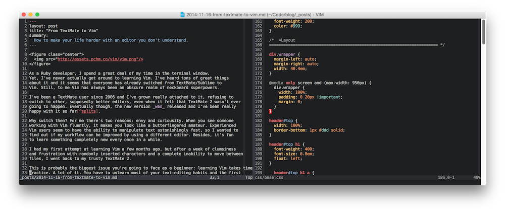
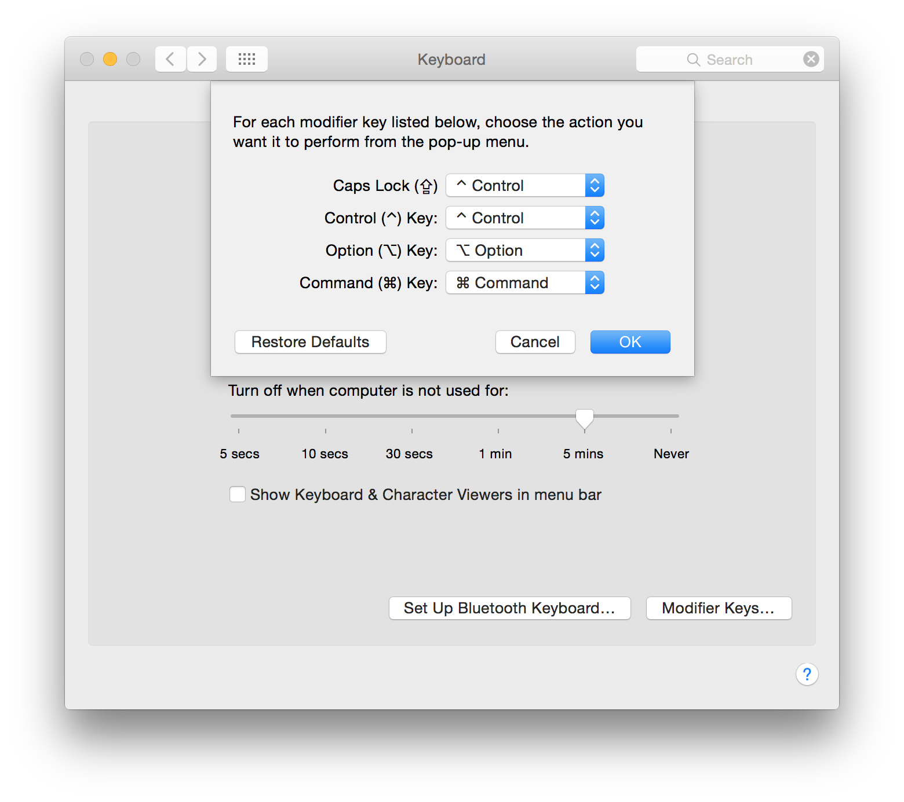

# From TextMate to Vim

As a Ruby developer, I spend a great deal of my time in the terminal window.
Yet, I never actually got around to learning Vim. I've heard tons of great things
about it and it seems that everyone has already switched from TextMate/Sublime to
Vim. Still, to me Vim has always been an obscure realm of neckbeard superpowers.



I've been a TextMate user since 2006 and I've grown really attached to it, refusing to
switch to other, supposedly better editors, even when it felt that TextMate 2 wasn't ever
going to happen. Eventually though, the new version _was_ released and I've been really
happy with it so far[^splits].

Why switch then? For me there's two reasons: envy and curiosity. When you see someone
working with Vim fluently, it makes you look like a butterfingered amateur. Experienced
Vim users seem to have the ability to manipulate text astonishingly fast, so I wanted to
find out if my workflow can be improved by using a different editor. Besides, it's fun
to learn something completely new every once in a while.

I had my first attempt at learning Vim a few months ago, but after a week of clumsiness
and frustration with randomly inserted characters and a complete inability to move between
files, I went back to my trusty TextMate 2.

This is probably the biggest issue you're going to face as a beginner: learning Vim takes time and
practice. A lot of it. You have to unlearn most of your text-editing habits and the first
few days (weeks, really) can be frustrating, especially when you have work to do and your
editor isn't cooperating.
Also, compared to my other day-to-day apps, Vim feels like a
[really dated technology][hiltmon] that somehow survived in the era of GUI.

Nevertheless, with a bit of practice and patience, the appeal of Vim is hard to deny,
so I decided to give it another shot.

## Getting Started

If you're a Mac user, you have a couple of options: you can either run Vim in a terminal
([iTerm2][iterm] in my case) or use a GUI-based version, like [MacVim][macvim]. I've
tried the former, but I've run into lots of issues with colors and rendering, which
didn't look quite as great as in MacVim. Also, MacVim allows you to use the familiar
shortcuts like <kbd>cmd</kbd>+<kbd>s</kbd>, <kbd>cmd</kbd>+<kbd>w</kbd> or
<kbd>cmd</kbd>+<kbd>t</kbd>. It's probably an anti-pattern in the Vim world, but I have
years of muscle memory for these keystrokes and it's nearly impossible for me to unlearn
hitting <kbd>cmd</kbd>+<kbd>s</kbd> in my editor.

The great advantage of TextMate is that you can pick it up, learn a few keyboard shortcuts
and everything just works. Vim, in contrast, is notoriously difficult to grasp and it's
pretty much useless without a decent `.vimrc` file and a bunch of essential plugins. If
you're just starting out, it's tempting to install something like
[Janus][janus] which sets up a dozens of plugins and settings for you. However, my advice
is to start with a very basic `.vimrc` file you're going to build upon later. Make sure
that you understand the purpose of every line in that file.

The `vimtutor` command is a great starting point. It takes about 30 minutes to complete
and it will give you a good idea of how Vim works and what you can do with it. Next, move
on to the amazing [tutorial by Mislav][mislav] and watch a few [Vimcasts][vimcasts].
It's also a good idea to learn about some of the [anti-patterns][antipatterns] that you
should aim to avoid from the very beginning. This is probably enough to get going.

## Beginner's Tips

There are a couple of tips that helped me get started and made my life with Vim a bit
easier. Keep in mind that I'm a beginner, so they may eventually be proven wrong or
sub-optimal.

### Disable the Arrow Keys

Using the arrow keys to move around is considered an anti-pattern, so be sure to disable
them and use <kbd>h</kbd><kbd>j</kbd><kbd>k</kbd><kbd>l</kbd> instead. It may seem weird
at first, but once you get used to it, it's going to make sense.

```vim
nnoremap <Left> :echoe "Use h"<CR>
nnoremap <Right> :echoe "Use l"<CR>
nnoremap <Up> :echoe "Use k"<CR>
nnoremap <Down> :echoe "Use j"<CR>
```

### Move Between Splits Easily

I find myself switching between split panes a lot and the default keystroke
<kbd>ctrl</kbd>+<kbd>w</kbd>+<kbd>h</kbd> (or <kbd>j</kbd> <kbd>k</kbd> <kbd>l</kbd>)
is a bit long, so I've changed it to skip the <kbd>w</kbd> key:

```vim
nnoremap <c-j> <c-w>j
nnoremap <c-k> <c-w>k
nnoremap <c-h> <c-w>h
nnoremap <c-l> <c-w>l
```

### Remap Caps Lock

One really useful tip I discovered watching [Destroy All Software][das] is to
remap <kbd>caps lock</kbd> to <kbd>ctrl</kbd>. The <kbd>ctrl</kbd> key on the Mac
keyboard is relatively hard to reach, so this little modification will save you
some pinky stretching.



### Exit Insert Mode

When you're starting out, it's tempting to stay in the insert mode all the time, but if
you want to learn Vim the right way you should aim to exit to normal mode as soon as
possible.

The <kbd>esc</kbd> key is also a bit far away and you'll be switching between the normal
and insert mode quite a lot, so consider the following:

```vim
inoremap jj <ESC>
```

It will allow you to exit the insert mode by hitting <kbd>j</kbd><kbd>j</kbd>.

<small>**Note:** I no longer use this[^esc].</small>

### My `.vimrc`

If you'd like to take a look at my settings, you'll find them in
[my dotfiles on GitHub][dotfiles].

## Impressions?

I've been trying to use Vim as my main editor for the past week and I'm slowly wrapping
my mind around it. However, I still find myself switching to TextMate whenever I need to
do something quickly.

There are things I absolutely love about Vim. When you grasp the basic commands and
motions, text editing becomes mind-blowingly fast. Split windows,
[Rails plugin][railsvim], ability to run tests and terminal commands in the same window
are my instant favorites.

As a long-time GUI user, I find working with a text-based interface a bit cumbersome.
I really miss my TextMate file drawer[^nerdtree]. Navigating files with Vim, when learned
properly, can be quick and efficient, but it's still helpful to be able to see the whole
directory structure[^tree], especially when you're working with an unfamiliar codebase.

In that regard, Vim does indeed feel like an editor built for the 70s, when there was
no better way of browsing and searching through files. Lots of Vim users will disagree,
saying that the terminal is the best GUI. Well, for me it isn't.

That said, I've been enjoying the process and I've made lots of progress, so there's hope
that eventually using Vim will make perfect sense.

## Resources

* [Vim: revisited][mislav]
* [Your problem with Vim is that you don't grok vi][stackoverflow]
* [Vim Anti-patterns][antipatterns]
* [Vimcasts][vimcasts]
* [Coming Home to Vim][cominghome]
* [thoughtbot dotfiles][thoughtbot]

[^splits]: Although split panes would be great to have.
[^nerdtree]: I can't stand the ugliness of [NERDTree](https://github.com/scrooloose/nerdtree), so that's not an option. There's a [fork of MacVim](https://github.com/alloy/macvim) that implements a TM-like file drawer, but it hasn't been updated in over a year, so it's probably not safe to use.
[^tree]: The `tree` command doesn't cut it for me.
[^esc]:  I've since remapped my Caps lock key to act as both <kbd>Esc</kbd> when tapped and <kbd>Ctrl</kbd> when held down with another key (Dec, 2015).

[vimcasts]: http://vimcasts.org
[macvim]: https://code.google.com/p/macvim/
[iterm]: https://iterm2.com
[antipatterns]: http://blog.sanctum.geek.nz/vim-anti-patterns/
[hiltmon]: http://hiltmon.com/blog/2012/10/08/stop-with-the-old-text-editors-already/
[janus]: https://github.com/carlhuda/janus
[mislav]: http://mislav.uniqpath.com/2011/12/vim-revisited/
[thoughtbot]: https://github.com/thoughtbot/dotfiles
[stackoverflow]: http://stackoverflow.com/questions/1218390/what-is-your-most-productive-shortcut-with-vim/1220118#1220118
[das]: https://www.destroyallsoftware.com/screencasts/catalog/some-vim-tips
[dotfiles]: https://github.com/pch/dotfiles/tree/master/vim
[cominghome]: http://stevelosh.com/blog/2010/09/coming-home-to-vim/
[railsvim]: https://github.com/tpope/vim-rails

